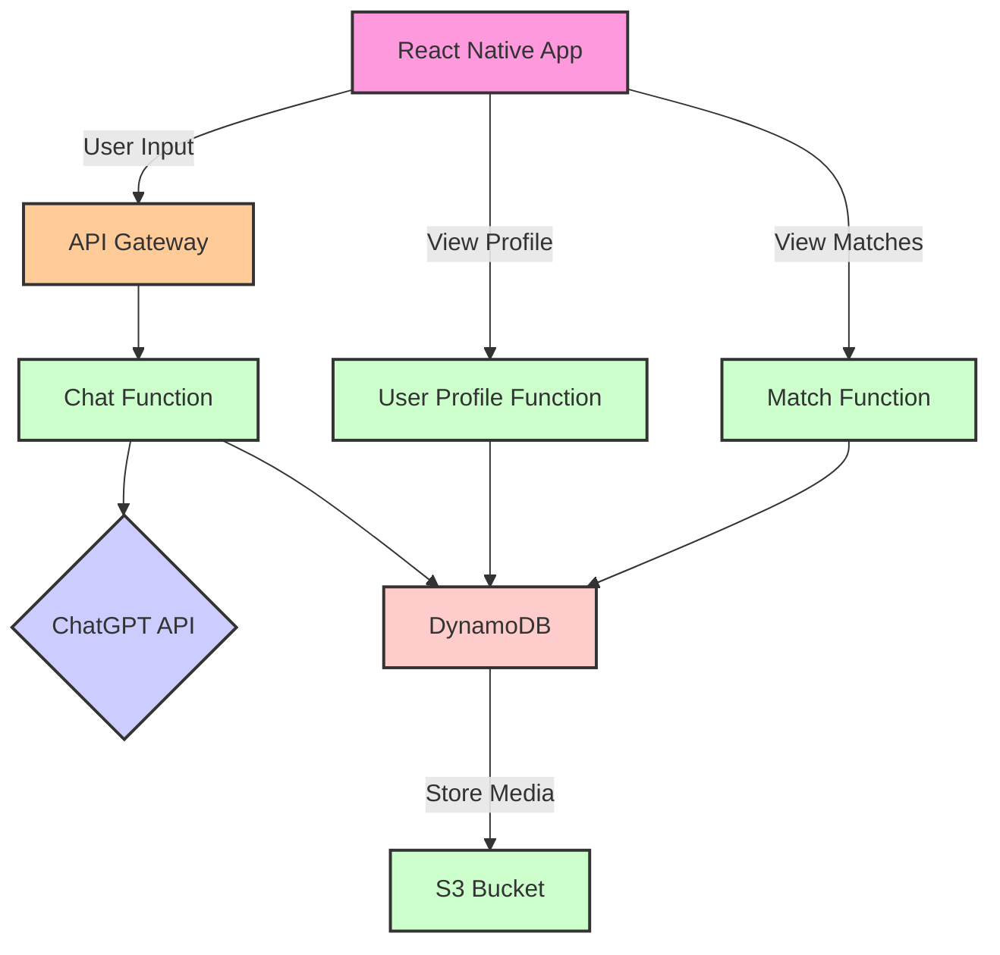

## Introduction

### AI MatchMate: Blending Conversations and Visuals for the Perfect Match

Navigating the world of modern dating can often feel like a maze. Traditional dating apps prioritize swiping left or right based on visuals, sometimes leading to choices that are influenced by inherent biases or fleeting emotions. On the flip side, basing matches purely on textual profiles can miss out on the undeniable human element of physical attraction.

Enter AI MatchMate, an innovative dating app that seeks to harmonize both worlds. At its heart lies a conversational approach where users engage with an AI, discussing their interests, values, and desires. These dynamic conversations, powered by OpenAI's ChatGPT, form the foundation for potential matches. While the primary focus is on conversation, AI MatchMate recognizes the importance of visuals and aims to incorporate profile pictures in its matching algorithm, ensuring a holistic matching experience.

Taking the decision-making responsibility from users and entrusting it to a sophisticated AI helps reduce the pitfalls of human error and biases. This AI-driven approach aims for matches that resonate on multiple levels, not just surface attraction.

In this case study, we'll unpack the inspiration behind AI MatchMate, explore the technology stack underpinning it, and traverse the development journey. We'll also delve into challenges faced, the pivotal role of user experience, and the feedback mechanisms designed to continuously refine the app's matchmaking prowess.

## The Idea Behind AI MatchMate

### Rethinking Dating in a Digital Age

The digital age has revolutionized the way we find love. However, with this convenience comes a set of challenges. Traditional dating apps, while popular, often place a heavy emphasis on visual cues. The rapid swipe-left, swipe-right culture can sometimes lead to matches that lack depth. Additionally, the cognitive load of choosing from an endless stream of profiles can lead to decision fatigue among users.

####  Why Not Just Textual Profiles?

Simply resorting to textual profiles isn't the solution either. While they can provide a snapshot of an individual's interests and personality, they often lack spontaneity and can be carefully curated, missing the genuine human element.

#### Enter Conversational AI

This is where the idea for AI MatchMate was born. Instead of relying purely on images or text, why not harness the power of conversation? Conversations, especially those that are dynamic and spontaneous, can provide a more genuine insight into a person's character and interests.

By incorporating a chat interface where users converse with an AI, we can capture the essence of these conversations. The AI listens, understands, and then matches based on the depth and nuances of these chats. And while the focus is on conversation, the potential to combine this with visual cues in the future ensures a rounded and holistic approach to matchmaking.

#### Reducing Human Biases

Another significant advantage of this approach is the reduction of human biases in the decision-making process. By allowing the AI to handle matches, we mitigate the risk of choices influenced by biases or transient feelings. The AI, with its vast knowledge and unbiased approach, can potentially create matches that are more attuned to long-term compatibility.

## Choosing the Technology Stack

### Crafting the Perfect Blend for AI MatchMate

When building a cutting-edge app, the choice of technology is paramount. It's not about chasing the latest buzzwords, but aligning tools and frameworks with the app's mission. For AI MatchMate, we needed real-time performance, effortless scalability, and seamless AI integration.

####  React Native: Cross-Platform Magic

For the frontend, **React Native** was the obvious choice. Here's why:

- **Cross-Platform Compatibility**: With React Native, we can write the app's code once and run it on both Android and iOS. This means a faster development cycle and a unified user experience across platforms.

- **Performance**: React Native offers near-native performance, ensuring smooth animations and responsive interfaces, which is essential for a chat-centric app like AI MatchMate.

- **Rich Ecosystem**: The vast library of plugins and community support for React Native means that integrating third-party services, like the OpenAI ChatGPT API, becomes a breeze.

#### AWS Amplify & Serverless: Swift Development

For the backend, the combination of AWS Amplify and the Serverless framework was a no-brainer:

- **Amplify's Simplified Setup**: Amplify's suite of tools harmonizes perfectly with React Native, enabling quick implementation of authentication, APIs, and storage. Real-time data synchronization across devices, especially crucial for dynamic chats, is made effortless with Amplify DataStore.

- **Serverless Deployment**: For nuanced backend configurations or specific deployment needs, the **Serverless framework** comes into play. Its deployment model, combined with native support for AWS services, ensures the backend remains both powerful and agile.

#### OpenAI ChatGPT: The AI Powerhouse

Central to AI MatchMate is its AI-driven conversational approach, and for this, **OpenAI's ChatGPT** was the go-to choice.

- **Natural Conversations**: ChatGPT is known for its ability to have human-like conversations, understanding nuances and context, which is crucial for gauging user preferences and personalities.

- **Real-time Analysis**: The API's rapid response time ensures that as users chat, their responses are analyzed in real time, allowing for dynamic profile-building and instant matches.

- **Continuous Learning**: With every conversation, ChatGPT learns and refines its understanding, ensuring that match suggestions only get better over time.

Through the amalgamation of these technologies, AI MatchMate promises a fluid and captivating platform for users in search of meaningful connections. This tech stack not only guarantees top-tier performance but also sets the stage for future enhancements and scalability.

## System Design & Architecture

### Blueprinting AI MatchMate's Infrastructure

To create a responsive, scalable, and robust app like AI MatchMate, a clear architectural blueprint is essential. This blueprint ensures that all components interact harmoniously, providing users with a seamless experience. Let's break down the - system design into its key components and their **interactions**.

#### Frontend: React Native Mobile Application with Amplify Integration

- **Chat Interface**: Users converse with ChatGPT AI here. Amplify's built-in components facilitate real-time communication with the backend.

- **User Profiles**: Amplify's authentication modules ensure secure user sign-up and login. Users can view and edit their details, which are stored securely on AWS.

- **Match Interface**: Post-AI match suggestion, users can initiate chats with potential matches.

#### Backend: Amplify & Serverless on AWS

- **Amplify CLI**: Used to set up and manage backend services. With a few commands, we can initialize cloud resources, including Lambda functions, API routes, and DynamoDB tables.

- **API (Amplify + Serverless)**: Amplify simplifies the creation of a RESTful API, while the Serverless framework aids in deploying and managing API Gateway and Lambda functions.

    - _Chat Function_: Manages real-time chat between the user and ChatGPT.

    - _UserProfile Function_: Deals with user profile data.

    - _Match Function_: Manages AI match suggestions and user - **interactions**.

- **DynamoDB (Amplify + Serverless)**: Amplify's data access patterns and the Serverless framework's templates expedite the setup and management of DynamoDB tables.

    - _Users Table_: Contains user profile data.

    - - _Chats Table_: Logs chat **interactions** and AI analysis.

S3 Bucket (Amplify): Amplify's storage module sets up and manages S3 buckets, potentially holding user profile pictures and other media.


#### Integration with OpenAI ChatGPT (Serverless)

- The Serverless framework makes it straightforward to integrate external APIs. When a user chats, the Chat Function in Lambda, set up using Serverless, communicates with ChatGPT, processes its response, and relays it back to the frontend.


#### System Interaction Flow with Amplify & Serverless

- User starts a chat via the React Native app.
- Amplify's API management tools forward this input to the API Gateway.
- The Serverless framework ensures the API Gateway directs this to the right Lambda function.
- The Chat Function talks to ChatGPT, processes the AI response, and returns it.
- Amplify's real-time data capabilities ensure this response swiftly reaches the user.
- Simultaneously, chat data, through Amplify's data access patterns and Serverless templates, gets stored in the DynamoDB Chats Table.

This synergy between Amplify and Serverless ensures a robust and efficient system, ready to scale as AI MatchMate grows.



## UI Design & Wireframing

### AI MatchMate: Envisioning the User Experience

#### Bottom Toolbar Navigation:

A fixed toolbar at the bottom of the screen, housing icons/buttons for the primary sections: Chat, Profile, and Matches. This allows users to effortlessly switch between the core features of the app.

#### 1. Splash Screen

- **Description**: A welcoming screen setting the app's tone. It prominently displays the app's logo, potentially accompanied by a subtle animation or catchy tagline.
- **Interactions**: After a brief duration or initial data loading, users transition to the Onboarding/Chat Interface.


#### 2. Onboarding/Chat Interface

- **Description**: The app's core. A minimalist design prioritizing conversation. The top has a header indicating chat with the AI. User and AI messages should be visually distinct through contrasting colors or alignments. The bottom is for user input with an intuitive send button.
- **Interactions**: As users converse, their chat history scrolls up. The bottom toolbar allows direct access to the Profile and Matches screens.

#### 3. Profile Screen

- **Description**: Centered on the user. The top features a large, circular placeholder for the profile picture with an option to change or upload. Below, personal details like name, age, and a brief bio are displayed. Crucially, a section for users to input their preferred contact information (like email or external app username) is present. Note: By adding their contact info, users are agreeing to share this with potential matches.
- **Interactions**: An edit icon/button allows details modification. The bottom toolbar offers a quick switch to Chat and Matches.

#### 4. Matches Screen

- **Description**: A list-style layout showing potential matches. Each entry offers the match's name and a chat snippet that led to the match.
- **Interactions**: Tapping a match entry reveals detailed contact info in the Match Details Screen. The bottom toolbar ensures easy navigation back to Chat or Profile.

#### 5. Match Details Screen

- **Description**: Accessible after tapping a match. Displays the match's name, profile picture, and chat snippet. The central feature is the contact information section, showcasing the matched user's preferred contact method, urging users to communicate outside AI MatchMate.
- **Interactions**: A clear "Back" or "Return" button ensures users can navigate back to the Matches Screen.


#### Associations & Flow:

- The Splash Screen naturally leads users to the Onboarding/Chat Interface.
- The bottom toolbar navigation ensures users can seamlessly switch between Chat, Profile, and Matches, providing an interconnected and fluid user experience.


## Development Process

### Setting Up the Development Environment

To kickstart our journey with AI MatchMate, it's crucial to have a seamless development environment. This environment will serve as the foundation upon which we build the entire application.

#### Step 1: Initialize a New React Native Project

1. Create a new React Native project named "AIMatchMate":

```bash
npx react-native@latest init AIMatchMate
``` 

2. Navigate to your project directory:

```bash
cd AIMatchMate
```

#### Step 2: Install Necessary Dependencies

For our app, we'll require a few crucial libraries:

1. Install Amplify libraries:

