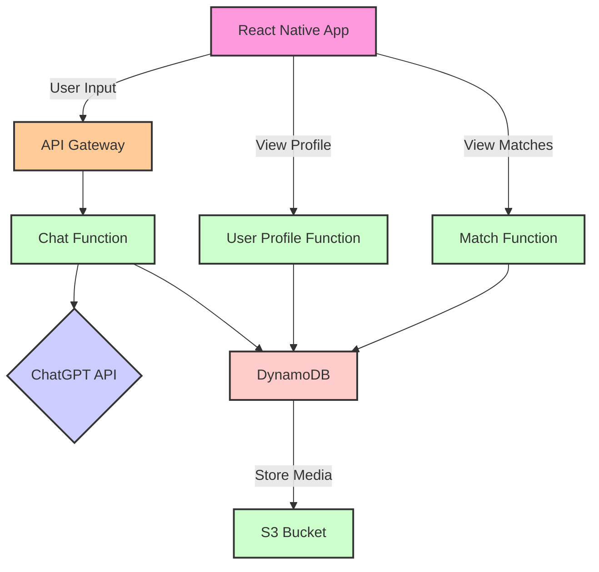

## Introduction

### AI MatchMate: Blending Conversations and Visuals for the Perfect Match

**IMPORTANT** This is a work in progress and as the project progresses, some information can become outdated.


Navigating the world of modern dating can often feel like a maze. Traditional dating apps prioritize swiping left or right based on visuals, sometimes leading to choices that are influenced by inherent biases or fleeting emotions. On the flip side, basing matches purely on textual profiles can miss out on the undeniable human element of physical attraction.

Enter AI MatchMate, an innovative dating app that seeks to harmonize both worlds. At its heart lies a conversational approach where users engage with an AI, discussing their interests, values, and desires. These dynamic conversations, powered by OpenAI's ChatGPT, form the foundation for potential matches. While the primary focus is on conversation, AI MatchMate recognizes the importance of visuals and aims to incorporate profile pictures in its matching algorithm, ensuring a holistic matching experience.

Taking the decision-making responsibility from users and entrusting it to a sophisticated AI helps reduce the pitfalls of human error and biases. This AI-driven approach aims for matches that resonate on multiple levels, not just surface attraction.

In this case study, we'll unpack the inspiration behind AI MatchMate, explore the technology stack underpinning it, and traverse the development journey. We'll also delve into challenges faced, the pivotal role of user experience, and the feedback mechanisms designed to continuously refine the app's matchmaking prowess.

## The Idea Behind AI MatchMate

### Rethinking Dating in a Digital Age

The digital age has revolutionized the way we find love. However, with this convenience comes a set of challenges. Traditional dating apps, while popular, often place a heavy emphasis on visual cues. The rapid swipe-left, swipe-right culture can sometimes lead to matches that lack depth. Additionally, the cognitive load of choosing from an endless stream of profiles can lead to decision fatigue among users.

####  Why Not Just Textual Profiles?

Simply resorting to textual profiles isn't the solution either. While they can provide a snapshot of an individual's interests and personality, they often lack spontaneity and can be carefully curated, missing the genuine human element.

#### Enter Conversational AI

This is where the idea for AI MatchMate was born. Instead of relying purely on images or text, why not harness the power of conversation? Conversations, especially those that are dynamic and spontaneous, can provide a more genuine insight into a person's character and interests.

By incorporating a chat interface where users converse with an AI, we can capture the essence of these conversations. The AI listens, understands, and then matches based on the depth and nuances of these chats. And while the focus is on conversation, the potential to combine this with visual cues in the future ensures a rounded and holistic approach to matchmaking.

#### Reducing Human Biases

Another significant advantage of this approach is the reduction of human biases in the decision-making process. By allowing the AI to handle matches, we mitigate the risk of choices influenced by biases or transient feelings. The AI, with its vast knowledge and unbiased approach, can potentially create matches that are more attuned to long-term compatibility.

## Choosing the Technology Stack

### Crafting the Perfect Blend for AI MatchMate

When building a cutting-edge app, the choice of technology is paramount. It's not about chasing the latest buzzwords, but aligning tools and frameworks with the app's mission. For AI MatchMate, we needed real-time performance, effortless scalability, and seamless AI integration.

####  React Native: Cross-Platform Magic

For the frontend, **React Native** was the obvious choice. Here's why:

- **Cross-Platform Compatibility**: With React Native, we can write the app's code once and run it on both Android and iOS. This means a faster development cycle and a unified user experience across platforms.

- **Performance**: React Native offers near-native performance, ensuring smooth animations and responsive interfaces, which is essential for a chat-centric app like AI MatchMate.

- **Rich Ecosystem**: The vast library of plugins and community support for React Native means that integrating third-party services, like the OpenAI ChatGPT API, becomes a breeze.

#### AWS Amplify & Serverless: Swift Development

For the backend, the combination of AWS Amplify and the Serverless framework was a no-brainer:

- **Amplify's Simplified Setup**: Amplify's suite of tools harmonizes perfectly with React Native, enabling quick implementation of authentication, APIs, and storage. Real-time data synchronization across devices, especially crucial for dynamic chats, is made effortless with Amplify DataStore.

- **Serverless Deployment**: For nuanced backend configurations or specific deployment needs, the **Serverless framework** comes into play. Its deployment model, combined with native support for AWS services, ensures the backend remains both powerful and agile.

#### OpenAI ChatGPT: The AI Powerhouse

Central to AI MatchMate is its AI-driven conversational approach, and for this, **OpenAI's ChatGPT** was the go-to choice.

- **Natural Conversations**: ChatGPT is known for its ability to have human-like conversations, understanding nuances and context, which is crucial for gauging user preferences and personalities.

- **Real-time Analysis**: The API's rapid response time ensures that as users chat, their responses are analyzed in real time, allowing for dynamic profile-building and instant matches.

- **Continuous Learning**: With every conversation, ChatGPT learns and refines its understanding, ensuring that match suggestions only get better over time.

Through the amalgamation of these technologies, AI MatchMate promises a fluid and captivating platform for users in search of meaningful connections. This tech stack not only guarantees top-tier performance but also sets the stage for future enhancements and scalability.

## System Design & Architecture

### Blueprinting AI MatchMate's Infrastructure

To create a responsive, scalable, and robust app like AI MatchMate, a clear architectural blueprint is essential. This blueprint ensures that all components interact harmoniously, providing users with a seamless experience. Let's break down the - system design into its key components and their **interactions**.

#### Frontend: React Native Mobile Application with Amplify Integration

- **Chat Interface**: Users converse with ChatGPT AI here. Amplify's built-in components facilitate real-time communication with the backend.

- **User Profiles**: Amplify's authentication modules ensure secure user sign-up and login. Users can view and edit their details, which are stored securely on AWS.

- **Match Interface**: Post-AI match suggestion, users can initiate chats with potential matches.

#### Backend: Amplify & Serverless on AWS

- **Amplify CLI**: Used to set up and manage backend services. With a few commands, we can initialize cloud resources, including Lambda functions, API routes, and DynamoDB tables.

- **API (Amplify + Serverless)**: Amplify simplifies the creation of a RESTful API, while the Serverless framework aids in deploying and managing API Gateway and Lambda functions.

    - _Chat Function_: Manages real-time chat between the user and ChatGPT.

    - _UserProfile Function_: Deals with user profile data.

    - _Match Function_: Manages AI match suggestions and user - **interactions**.

- **DynamoDB (Amplify + Serverless)**: Amplify's data access patterns and the Serverless framework's templates expedite the setup and management of DynamoDB tables.

    - _Users Table_: Contains user profile data.

    - - _Chats Table_: Logs chat **interactions** and AI analysis.

S3 Bucket (Amplify): Amplify's storage module sets up and manages S3 buckets, potentially holding user profile pictures and other media.


#### Integration with OpenAI ChatGPT (Serverless)

- The Serverless framework makes it straightforward to integrate external APIs. When a user chats, the Chat Function in Lambda, set up using Serverless, communicates with ChatGPT, processes its response, and relays it back to the frontend.


#### System Interaction Flow with Amplify & Serverless

- User starts a chat via the React Native app.
- Amplify's API management tools forward this input to the API Gateway.
- The Serverless framework ensures the API Gateway directs this to the right Lambda function.
- The Chat Function talks to ChatGPT, processes the AI response, and returns it.
- Amplify's real-time data capabilities ensure this response swiftly reaches the user.
- Simultaneously, chat data, through Amplify's data access patterns and Serverless templates, gets stored in the DynamoDB Chats Table.

This synergy between Amplify and Serverless ensures a robust and efficient system, ready to scale as AI MatchMate grows.



## UI Design & Wireframing

### AI MatchMate: Envisioning the User Experience

#### Bottom Toolbar Navigation:

A fixed toolbar at the bottom of the screen, housing icons/buttons for the primary sections: Chat, Profile, and Matches. This allows users to effortlessly switch between the core features of the app.

#### 1. Splash Screen

- **Description**: A welcoming screen setting the app's tone. It prominently displays the app's logo, potentially accompanied by a subtle animation or catchy tagline.
- **Interactions**: After a brief duration or initial data loading, users transition to the Onboarding/Chat Interface.


#### 2. Onboarding/Chat Interface

- **Description**: The app's core. A minimalist design prioritizing conversation. The top has a header indicating chat with the AI. User and AI messages should be visually distinct through contrasting colors or alignments. The bottom is for user input with an intuitive send button.
- **Interactions**: As users converse, their chat history scrolls up. The bottom toolbar allows direct access to the Profile and Matches screens.

#### 3. Profile Screen

- **Description**: Centered on the user. The top features a large, circular placeholder for the profile picture with an option to change or upload. Below, personal details like name, age, and a brief bio are displayed. Crucially, a section for users to input their preferred contact information (like email or external app username) is present. Note: By adding their contact info, users are agreeing to share this with potential matches.
- **Interactions**: An edit icon/button allows details modification. The bottom toolbar offers a quick switch to Chat and Matches.

#### 4. Matches Screen

- **Description**: A list-style layout showing potential matches. Each entry offers the match's name and a chat snippet that led to the match.
- **Interactions**: Tapping a match entry reveals detailed contact info in the Match Details Screen. The bottom toolbar ensures easy navigation back to Chat or Profile.

#### 5. Match Details Screen

- **Description**: Accessible after tapping a match. Displays the match's name, profile picture, and chat snippet. The central feature is the contact information section, showcasing the matched user's preferred contact method, urging users to communicate outside AI MatchMate.
- **Interactions**: A clear "Back" or "Return" button ensures users can navigate back to the Matches Screen.

#### Associations & Flow:

- The Splash Screen naturally leads users to the Onboarding/Chat Interface.
- The bottom toolbar navigation ensures users can seamlessly switch between Chat, Profile, and Matches, providing an interconnected and fluid user experience.

#### UI Diagram 

The following diagram demonstrates the above concepts and discussed screens:


## Development Process

### Setting Up the Development Environment

To kickstart our journey with AI MatchMate, it's crucial to have a seamless development environment. This environment will serve as the foundation upon which we build the entire application.

#### Step 1: Initialize a New React Native Project

1. Create a new React Native project named "AIMatchMate":

```bash
npx react-native@latest init AIMatchMate
``` 

2. Navigate to your project directory:

```bash
cd AIMatchMate
```

#### Step 2: Install Necessary Dependencies

For our app, we'll require a few crucial libraries:

1. Install React Navigation for handling in-app navigation. Then, for detailed installation and linking instructions, especially for platforms like iOS which might require pod installations, follow the official [React Navigation getting started guide](https://reactnavigation.org/docs/getting-started/).

```bash
npm install @react-navigation/native @react-navigation/stack
```

2. To style our components, we'll use [Emotion](https://emotion.sh/docs/@emotion/native). Install the necessary libraries for Emotion in React Native:

```bash
npm install @emotion/react @emotion/native
```

3. Install FontAwesome for using SVG vector icons in our app:

```bash
npm i --save react-native-svg @fortawesome/fontawesome-svg-core @fortawesome/free-solid-svg-icons  @fortawesome/react-native-fontawesome
```

4. Adding the Lexend Google Font

    1. Download the **.ttf** font files for Inter (Regular and Bold) from the Google Fonts website.
    2. Create an **assets/fonts/** directory in your app's root.
    3. Place the downloaded .ttf files into **assets/fonts/**.
    3. Create a **react-native-config.js** file in the root with the following
    ```
    module.exports = {
        project: {
            ios: {},
            android: {},
        },
        assets: ['./assets/fonts'],
    };
    ```
    4. To link the fonts into your React Native project, run:
        
    ```bash
    npx react-native-asset 
    ```


#### Step 3: AWS Configuration

1. Install the AWS CLI. Follow [the official guide](https://aws.amazon.com/cli/) for your specific OS.

2. Configure the AWS CLI with your credentials:

```bash
aws configure
``` 

Enter your AWS Access Key, Secret Key, preferred region, and desired output format when prompted.

#### Step 4: Initialize Amplify in your Project

1. Install Amplify CLI. Follow the [official React Native instructions](https://docs.amplify.aws/start/getting-started/setup/q/integration/react-native):

```bash
npm install -g @aws-amplify/cli
```

2. Install amplify's related libraries

```bash
npm install aws-amplify amazon-cognito-identity-js @react-native-community/netinfo @react-native-async-storage/async-storage
```

2. Initialize Amplify inside your React Native project:

```sh
% amplify init        
Note: It is recommended to run this command from the root of your app directory
? Enter a name for the project aimatchmate

# Use default config

? Initialize the project with the above configuration? Yes
Using default provider  awscloudformation
? Select the authentication method you want to use: AWS profile

For more information on AWS Profiles, see:
https://docs.aws.amazon.com/cli/latest/userguide/cli-configure-profiles.html

? Please choose the profile you want to use: amplify
```


### Laying out the Application Frontend

#### 1. Establish a directory structure:

A neat structure with directories for screens, components, layouts, providers, and utilities keeps everything organized.

```
app/src
├── App.tsx
├── Layout
│   ├── Authenticated.tsx
│   ├── RootStack.tsx
│   └── TabsLayout.tsx
├── Providers
│   ├── NavigationProvider.tsx
│   ├── ThemeProvider.tsx
│   └── index.tsx
├── components
│   ├── Button.tsx
│   └── MessageBubble.tsx
├── emotion.d.ts
├── hooks
│   └── useNavigation.ts
├── screens
│   ├── ChatScreen.tsx
│   ├── MatchDetailsScreen.tsx
│   ├── MatchesScreen.tsx
│   ├── ProfileScreen.tsx
│   └── SplashScreen.tsx
└── utils
    ├── data.ts
    └── theme.ts
``` 

#### 2. Implement the theme:

#### Brand

We will utilize a 4-color brand palette, from which we will derive all app colors:


#### Theme

The theme.ts in the utils/ directory consolidates the font styles, color palette, and standard spacing values.

https://github.com/alainux/ai-matchmate/blob/75fd18dbffbaff0f0e1582998a0a76d5938057f6/app/src/utils/theme.ts#L1-L108

Some important considerations for the theme: 

- Central location for theme tokens and space units.
- Common component styling such as surface, containers.
- Central location for font and text variations.
- A small amount of initial brand colors derive all uses.

This will give the app UI a consistent look and feel.

#### 3. Design the splash screen:

The SplashScreen.tsx serves as the first touchpoint for users.

https://github.com/alainux/ai-matchmate/blob/75fd18dbffbaff0f0e1582998a0a76d5938057f6/app/src/screens/SplashScreen.tsx#L1-L39


#### 4. Tab navigation:

The TabsLayout.tsx handles bottom tab navigation, with tabs for Chat, Matches, and Profile.

https://github.com/alainux/ai-matchmate/blob/75fd18dbffbaff0f0e1582998a0a76d5938057f6/app/src/Layout/TabsLayout.tsx#L1-L73


#### 5. Root stack navigation:

The RootLayout.tsx file acts as the central navigation system, transitioning from the SplashScreen to the TabsLayout upon initialization. We will deliver is from Authenticated.tsx, which will become our main entry point after the user has logged in.

https://github.com/alainux/ai-matchmate/blob/75fd18dbffbaff0f0e1582998a0a76d5938057f6/app/src/Layout/Authenticated.tsx#L1-L6

https://github.com/alainux/ai-matchmate/blob/75fd18dbffbaff0f0e1582998a0a76d5938057f6/app/src/Layout/RootStack.tsx#L1-L42

#### Creating the Screens

##### 1. Chat Screen:

The ChatScreen.tsx fosters interaction between the user and the matchmaker bot. This space is designed for intuitive chat flow.

https://github.com/alainux/ai-matchmate/blob/75fd18dbffbaff0f0e1582998a0a76d5938057f6/app/src/screens/ChatScreen.tsx#L1-L106


##### 2. Matches Screen:

MatchesScreen.tsx presents potential matches, with each card navigating to a detailed view upon interaction.

https://github.com/alainux/ai-matchmate/blob/75fd18dbffbaff0f0e1582998a0a76d5938057f6/app/src/screens/MatchesScreen.tsx#L1-L69


##### 3. Match Details Screen:

MatchDetailsScreen.tsx offers a deeper look into matches, showcasing a detailed bio, name, profile image, and contact information.

https://github.com/alainux/ai-matchmate/blob/75fd18dbffbaff0f0e1582998a0a76d5938057f6/app/src/screens/MatchDetailsScreen.tsx#L1-L67


##### 4. Profile Screen:
The ProfileScreen.tsx allows users to view and edit their profile, providing fields for name, email, bio, contact details, and a profile image.

https://github.com/alainux/ai-matchmate/blob/75fd18dbffbaff0f0e1582998a0a76d5938057f6/app/src/screens/ProfileScreen.tsx#L1-L138


#### Final Styling Touches

With Emotion's styled-components approach, styling components becomes modular and clean. Coupled with FontAwesome icons and the Inter font, the design remains consistent and elegant across all screens.

### Backend Development

Building a robust and efficient backend is crucial for our AI-driven matchmaker application. We need a reliable system to manage user data, handle the AI matching process, and store potential matches for each user.

#### 1. Configure Amplify

Add the required Amplify configuration so that we can start building the basic backend integration.

https://github.com/alainux/ai-matchmate/blob/77b3550749496c85adcceadd95104a5fcc2d7b75/app/index.js#L8-L11

#### 2. Add auth

Amplify provides authentication modules out-of-the-box. By running the above command, you can configure and add authentication to your project.

```sh
% amplify add auth
Using service: Cognito, provided by: awscloudformation
The current configured provider is Amazon Cognito. 
Do you want to use the default authentication and security configuration? Default configuration
Warning: you will not be able to edit these selections. 
How do you want users to be able to sign in? Email
Do you want to configure advanced settings? No, I am done.
```

For now, we will just use email and password authentication.
Amplify includes some React Native specific UI components you'll use to build your app. Install it with the following command:

```sh
npm install @aws-amplify/ui-react-native react-native-safe-area-context react-native-get-random-values react-native-url-polyfill
```

##### Add AuthenticatorProvider

In order to work with Amplify auth, we need to implement the higher order functions that they provide. For this, we will create a **AuthenticatorProvider.tsx** file that contains the necessary components and the theme overrides we need in order to implement the Amplify UI.

https://github.com/alainux/ai-matchmate/blob/2b0ca490d8c005ecd213bc76c585a56e05baae09/app/src/Providers/AuthenticatorProvider.tsx#L1-L115


#### 3. Add the api

The power of AWS Amplify lies in its ability to auto-generate much of the necessary backend resources and code based on a GraphQL schema. Here's how you can set it up:

```sh
% amplify add api        
? Select from one of the below mentioned services: GraphQL
? Here is the GraphQL API that we will create. Select a setting to edit or continue Authorization modes: API key (default, expiration time: 7 days from now)
? Choose the default authorization type for the API Amazon Cognito User Pool
Use a Cognito user pool configured as a part of this project.
? Configure additional auth types? No
? Here is the GraphQL API that we will create. Select a setting to edit or continue Continue
? Choose a schema template: Objects with fine-grained access control (e.g., a project management app with owner-based authorization)
...
✅ GraphQL schema compiled successfully.
```

##### Defining the schema

Amplify will create a schema.graphql file within the `amplify/backend/api/{yourApiName}/` directory. This is where you'll define your data types and relationships.

https://github.com/alainux/ai-matchmate/blob/b9e839288b8ecaa53f4dabe20eef855e76d92f49/app/amplify/backend/api/aimatchmate/schema.graphql#L1-L32

This schema will add the required models **Profile**, **Match**, and **ChatMessage** and their required authentication directives based on the AWS syntax, which can be referred to from the [official docs](https://docs.amplify.aws/cli/graphql/data-modeling/).

At this point you will push your changes to amplify, so **take a note of the graphql endpoint and API key**

```sh
% amplify push 
...
Deployment state saved successfully.

GraphQL endpoint: https://xxx.amazonaws.com/graphql
GraphQL API KEY: xxx

```

##### Creating Profile items during Cognito Signup 

For this we are going to make use of Cognito hooks which are lambda functions invoked on particular steps. It is fairly easy to generate them utilizing the Amplify CLI.

```sh
% amplify update auth
Please note that certain attributes may not be overwritten if you choose to use defaults settings.
Using service: Cognito, provided by: awscloudformation
 What do you want to do? Walkthrough all the auth configurations
 Select the authentication/authorization services that you want to use: User Sign-Up, Sign-In, connected
 with AWS IAM controls (Enables per-user Storage features for images or other content, Analytics, and mo
re)
 Allow unauthenticated logins? (Provides scoped down permissions that you can control via AWS IAM) No
 Do you want to enable 3rd party authentication providers in your identity pool? No
 Do you want to add User Pool Groups? No
 Do you want to add an admin queries API? No
 Multifactor authentication (MFA) user login options: OFF
 Email based user registration/forgot password: Enabled (Requires per-user email entry at registration)
 Specify an email verification subject: Your verification code
 Specify an email verification message: Your verification code is {####}
 Do you want to override the default password policy for this User Pool? No
 Specify the app's refresh token expiration period (in days): 30
 Do you want to specify the user attributes this app can read and write? No
 Do you want to enable any of the following capabilities? 
 Do you want to use an OAuth flow? No
? Do you want to configure Lambda Triggers for Cognito? Yes
? Which triggers do you want to enable for Cognito Pre Sign-up
? What functionality do you want to use for Post-Confirmation: Create your own module
✅ Successfully added resource aimatchmateXXXXPostConfirmation locally.
```

This will create a lambda function for your Post-Confirmation stage and prompt you to edit it. For the code, we are going to call the GraphQL API to create the resource, but before, we need to give the lambda function access to the API, so we will execute the following: 

```sh
% amplify update function 
? Select the Lambda function you want to update aimatchmateXXXXPostConfirmation
General information
- Name: aimatchmateXXXXPostConfirmation
- Runtime: nodejs

Resource access permission
- Not configured

Scheduled recurring invocation
- Not configured

Lambda layers
- Not configured

Environment variables:
- Not configured

Secrets configuration
- Not configured

? Which setting do you want to update? Resource access permissions
? Select the categories you want this function to have access to. api
? Select the operations you want to permit on aimatchmate Mutation

You can access the following resource attributes as environment variables from your Lambda function
	API_AIMATCHMATE_GRAPHQLAPIENDPOINTOUTPUT
	API_AIMATCHMATE_GRAPHQLAPIIDOUTPUT
	API_AIMATCHMATE_GRAPHQLAPIKEYOUTPUT
```

This will prompt you to the same file, which you can now edit. Take note of the used environment variables.

https://github.com/alainux/ai-matchmate/blob/b9e839288b8ecaa53f4dabe20eef855e76d92f49/app/amplify/backend/function/aimatchmate57a5e807PostConfirmation/src/custom.js#L1-L69

We can now register with the app and we will see a user being created in the AWS Cognito dashboard. We will also be able to get the corresponding user profile for that user.

#### 4. Displaying Profile
##### Updates to ProfileScreen.tsx

Now that we are able to read and update our profiles, we will go ahead and edit ProfileScreen.tsx:

https://github.com/alainux/ai-matchmate/blob/a1fdc76075fb56c8d54ff8cb55d53b9a8b3ce664/app/src/screens/ProfileScreen.tsx#L1-L222


#### 5. Creating and Showing Matches 

##### Implementing the createMatch Function

In the world of app development, especially when dealing with matchmaking logic, modularity is key. Given the complexities associated with determining matches and then storing or acting upon those matches, it's wise to break these steps down into manageable pieces. This not only makes the development process smoother but also eases future modifications and scaling.

###### Why a Separate createMatch Function?

- **Decoupling**: By separating the process of determining matches from the act of creating and storing them, we ensure that each function focuses on a singular task. This decoupling promotes easier troubleshooting, as issues can be isolated to a specific segment of the matchmaking process.

- **Flexibility & Reusability**: The createMatch function can be invoked in different contexts. Whether matches are determined through our primary AI-driven logic, manually by users, or by administrators, the same function can be utilized to save these matches.

- **Optimized Error Handling**: With a dedicated function, errors related to match creation, storage, or notification can be handled more effectively without getting tangled in the complexities of the matchmaking logic.

Go ahead and create the lambda function:

```sh
% amplify add function
? Select which capability you want to add: Lambda function (serverless function)
? Provide an AWS Lambda function name: createMatch
? Choose the runtime that you want to use: NodeJS
? Choose the function template that you want to use: Hello World
? Do you want to configure advanced settings? Yes
? Do you want to access other resources in this project from your Lambda function? Yes
? Select the categories you want this function to have access to. api
? Select the operations you want to permit on aimatchmate Mutation
? Do you want to invoke this function on a recurring schedule? No
? Do you want to enable Lambda layers for this function? No
? Do you want to configure environment variables for this function? No
? Do you want to configure secret values this function can access? No
✔ Choose the package manager that you want to use: · NPM
? Do you want to edit the local lambda function now? No
✅ Successfully added resource createMatch locally.
```

Considering that we have the right schema, we will go ahead and write the createMatch lambda function:

https://github.com/alainux/ai-matchmate/blob/b9e839288b8ecaa53f4dabe20eef855e76d92f49/app/amplify/backend/function/createMatch/src/index.js#L1-L118

Make sure to run `amplify configure function` in order to grant it access to the API. 

##### Invoking createMatch:
Once potential matches have been determined (be it through AI logic, user input, or other methods), it's time to solidify these connections using our createMatch function.


By invoking createMatch, you're taking the potential matches determined by your matchmaking logic and giving them tangible form within the app's infrastructure. This ensures users can view, interact with, and benefit from the connections the app facilitates. After this, you will be able to query the API using any client and see the matches.


#### 6. Building the AI-Driven Chat

The chat interface in AI MatchMate isn't just another messaging system; it's the heart of the application. The chat screen's purpose is multi-faceted: it not only engages users with AI-driven conversations but also helps in building a comprehensive psychological-emotional profile of the user. This profile becomes the cornerstone of the app's matchmaking process.

##### Understanding the AI-driven Chat Process:

**Initiating Conversation**: When a user enters the chat screen, the AI (MatchMate Bot) initiates the conversation, greeting the user and setting the tone.

**Probing Questions**: The AI starts asking open-ended questions. Each question is designed to reveal more about the user's personality, preferences, values, emotional state, and more. For instance, questions like:

- "What's your idea of a perfect weekend?"
- "How do you handle stress or conflict?"
- "Describe a memorable experience from your past."

**Building the Profile**: As the user responds, the AI interprets the answers and continually refines the user's psychological-emotional profile. This profile can have dimensions such as:

- **Emotional Stability**: Measures the user's ability to stay stable under pressure or stress.
- **Extraversion/Introversion**: Determines if a user is outgoing or reserved.
- **Openness**: Evaluates a user's willingness to experience new things.
- **Agreeableness**: Assesses a user's cooperative nature.
- **Conscientiousness**: Measures reliability and organization.

_Note_: This structure is inspired by the "Big Five" personality traits, which is a widely accepted personality theory. However, for simplicity, we're keeping it at these five dimensions.

**Storing the Profile**: Once the chat reaches a certain threshold, or the user decides to end it, the AI saves the profile to the user's record in the database using AppSync.

**Matchmaking**: With the psychological-emotional profile in place, the matchmaking process, which runs periodically or on-demand, checks profiles against each other. Profiles with complementary traits or closely matching values have a higher compatibility score. When a match is found, the createMatch function is invoked with both profile IDs.

##### Code implementation

###### Schema Changes for Messages

First we will augment our schema to include a `Messages` type that we will use to keep track of the user's conversation with the AI. We will also add a `traits` property to both the profile and the message. This property will help us keep track of the user's psychological profile.

https://github.com/alainux/ai-matchmate/blob/4241504e7ed9f337d3887b778d919ad1ed4f87e0/app/amplify/backend/api/aimatchmate/schema.graphql#L5-L60

###### Lambda for Answering Messages & Updating Personality Traits:

When a user sends a message from the chat screen, we invoke this Lambda. It communicates with the OpenAI API, fetches a response, updates the user's psychological profile, and returns the next message (and occasionally a personality description).

We will create an amplify function and configure it to have API access:

```
% amplify add function
? Select which capability you want to add: Lambda function (serverless function)
? Provide an AWS Lambda function name: createAiMessage
? Choose the runtime that you want to use: NodeJS
? Choose the function template that you want to use: Hello World
? Do you want to configure advanced settings? No
? Do you want to edit the local lambda function now? Yes
✅ Successfully added resource createAiMessage locally.

% amplify configure function
? Select the Lambda function you want to update createAiMessage
? Which setting do you want to update? Resource access permissions
? Select the categories you want this function to have access to. api
? Select the operations you want to permit on aimatchmate Mutation
```

Also, make sure to also add the Open API key to your function using secret values (SSM). This is done by selecting "secret values configuration" in `amplify configure function`.
We are now ready to write the lambda code. 

https://github.com/alainux/ai-matchmate/blob/4241504e7ed9f337d3887b778d919ad1ed4f87e0/app/amplify/backend/function/createAiMessage/src/index.js#L1-L345

This will use the `function_calls` functionality of the OpenAI ChatGPT API to make it keep track of a psychological profile of the person and ask follow-up questions in order to update our profile, which we will save in the updated profile and message properties.

**Why keep track of traits state on every message?** Because when delivering the message history to the AI (last 10 messages), we want to show the AI how each message affects the profile, giving it adequate context on how to respond.

###### ChatScreen Updates

We are now ready to update our ChatScreen.tsx file and we can start conversing with the AI and having the user's psychological profile updated.

https://github.com/alainux/ai-matchmate/blob/4241504e7ed9f337d3887b778d919ad1ed4f87e0/app/src/screens/ChatScreen.tsx#L1-L202

As shown in the image, the AI responds with a message and updates the state of the psychological profile at the same time.


###### findMatches Lambda Matching Function

**Matching Function**
Our matchmaking system is central to our app's functionality. The goal is to find profiles that are most compatible based on their psychological traits, which have been continually refined through interactions with the AI.

**Create the function using amplify:**

```
% amplify add function
? Select which capability you want to add: Lambda function (serverless function)
? Provide an AWS Lambda function name: findMatches
? Choose the runtime that you want to use: NodeJS
? Choose the function template that you want to use: Hello World

✅ Available advanced settings:
- Resource access permissions
- Scheduled recurring invocation
- Lambda layers configuration
- Environment variables configuration
- Secret values configuration

? Do you want to configure advanced settings? Yes
? Do you want to access other resources in this project from your Lambda function? Yes
? Select the categories you want this function to have access to. api
? Select the operations you want to permit on aimatchmate Query

You can access the following resource attributes as environment variables from your Lambda function
	API_AIMATCHMATE_GRAPHQLAPIENDPOINTOUTPUT
	API_AIMATCHMATE_GRAPHQLAPIIDOUTPUT
	API_AIMATCHMATE_GRAPHQLAPIKEYOUTPUT
	ENV
	REGION
? Do you want to invoke this function on a recurring schedule? Yes
? At which interval should the function be invoked: Daily
? Select the start time in UTC (use arrow keys): 10:00 AM
? Do you want to enable Lambda layers for this function? No
? Do you want to configure environment variables for this function? No
? Do you want to configure secret values this function can access? No
✔ Choose the package manager that you want to use: · NPM
? Do you want to edit the local lambda function now? No
✅ Successfully added resource findMatches locally.

```

**The Basic Implementation:**
The most straightforward approach to determine matches is to compare each user profile with every other profile in the system. This method, while straightforward, has clear scalability concerns, however, for now, it will do:

https://github.com/alainux/ai-matchmate/blob/84609ccff238fd39a0e8f505e6327ed1578e73c6/app/amplify/backend/function/findMatches/src/index.js#L1-L269

We will also add a findMatches GraphQL mutation which will take care of creating the missing matches.

https://github.com/alainux/ai-matchmate/blob/84609ccff238fd39a0e8f505e6327ed1578e73c6/app/amplify/backend/api/aimatchmate/schema.graphql#L13


